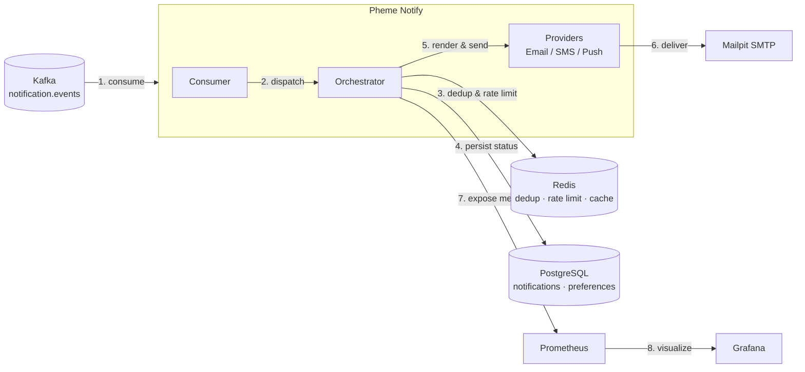
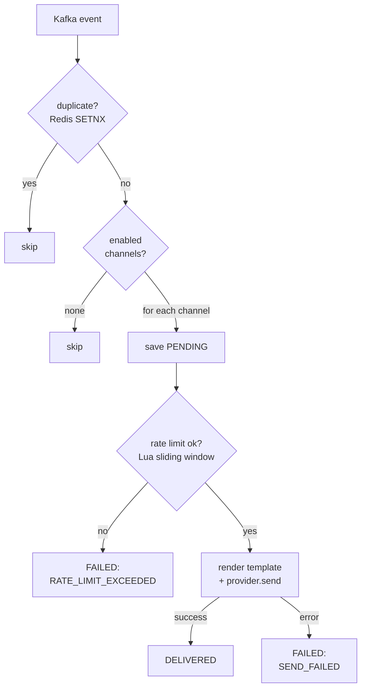

<p align="center">
  
</p>

<h1 align="center">Pheme Notify</h1>

Early-stage multi-channel notification microservice (work in progress). Pulls events from Kafka, dedupes and rate-limits with Redis, renders templates with Thymeleaf, and sends via Email/SMS/Push. Also wiring up Prometheus/Grafana for monitoring and PostgreSQL window-function queries for analytics.

## Architecture

High-level components and infrastructure:



## Notification flow

What happens to one Kafka event (see [FLOW.md](FLOW.md) for the detailed walkthrough):



If all Kafka retries are exhausted, the event goes to the DLT and is stored in
`failed_notifications` (JSONB); a scheduled retry job re-runs the same pipeline
with exponential backoff (skipping the dedup step). Channels are independent —
one channel failing doesn't block the others (partial failure). Sent/failed
counters and send-duration timers are recorded per channel via Micrometer.

## Event contract / Integration

This service is event-driven: other services publish events to Kafka, and Pheme Notify consumes them. The REST API is read-only (preferences, status, analytics) — it is not used to trigger notifications.

- **Bootstrap servers**: configured via `KAFKA_BOOTSTRAP_SERVERS` (see `.env.example`)
- **Topic**: `notification.events`
- **Format**: JSON, matching the `NotificationEvent` schema below

```json
{
  "id": "f47ac10b-58cc-4372-a567-0e02b2c3d479",
  "userId": "user-123",
  "eventType": "ORDER_COMPLETED",
  "channel": "EMAIL",
  "payload": {
    "orderId": "ORD-456",
    "amount": "99.90"
  },
  "occurredAt": "2026-06-14T12:00:00Z"
}
```

| Field | Type | Notes |
|-------|------|-------|
| `id` | string (UUID) | Idempotency key for deduplication (Redis `SETNX`, TTL 24h) |
| `userId` | string | Used for preferences and rate limiting |
| `eventType` | string | One of `ORDER_COMPLETED`, `USER_REGISTERED`, `PAYMENT_FAILED` (extensible via `EventTypeRegistry`) |
| `channel` | string | One of `EMAIL`, `SMS`, `PUSH` |
| `payload` | object (string → string) | Template placeholders, e.g. `${orderId}` |
| `occurredAt` | string (ISO-8601) | Event timestamp |

See `scripts/produce-test-events.sh` for a working example using `kafka-console-producer`.

To check delivery status without knowing the generated notification UUID, use
`GET /api/v1/notifications/status?eventId={id}&channel={channel}` with the same
`id`/`channel` values from the published event.

## Tech stack

- Java 21, Spring Boot 4
- Spring Kafka (`@RetryableTopic`, DLT)
- Spring Data JPA + PostgreSQL 17 + Flyway
- Spring Data Redis (Lettuce) + Lua scripting (rate limiting)
- Thymeleaf (email/SMS/push templates)
- Resilience4j (Circuit Breaker)
- Micrometer + Prometheus + Grafana
- Testcontainers (Kafka, PostgreSQL, Redis)

## Hard features

| # | Feature | Description |
|---|---------|-------------|
| H1 | Kafka delivery guarantee + dedup | `@RetryableTopic` (3 attempts, exponential backoff) → DLT → `failed_notifications`. Redis `SETNX dedup:{event.id}` TTL 24h. Partial failure: one channel failing doesn't block others. |
| H2 | Redis rate limiting | Atomic sliding-window via Lua script (`ZREMRANGEBYSCORE` + `ZCARD` + `ZADD`). Limits: email 5/h, sms 3/h, push 20/h. |
| H3 | Delivery analytics | Native SQL with `FILTER` + window functions (`AVG(...) OVER (... ROWS BETWEEN 6 PRECEDING AND CURRENT ROW)`) for daily delivery rate + rolling 7-day average. Cached in Redis (TTL 1h). |

## Getting started

```bash
cp .env.example .env
# edit .env — set passwords and KAFKA_CLUSTER_ID:
docker run --rm confluentinc/cp-kafka:7.9.0 kafka-storage random-uuid

docker compose --profile dev --profile observability up -d
```

| Service | URL |
|---------|-----|
| App | http://localhost:8080 |
| Swagger UI | http://localhost:8080/swagger-ui.html |
| Kafka UI | http://localhost:8090 |
| Mailpit (email inbox) | http://localhost:8025 |
| Prometheus | http://localhost:9090 |
| Grafana | http://localhost:3000 |

## API

| Method | Path | Description |
|--------|------|-------------|
| GET | `/api/v1/users/{id}/preferences` | Get user notification preferences |
| PUT | `/api/v1/users/{id}/preferences` | Update enabled channels |
| GET | `/api/v1/notifications/{id}/status` | Get notification delivery status |
| GET | `/api/v1/notifications/status?eventId=&channel=` | Get notification delivery status by Kafka event id + channel |
| GET | `/api/v1/analytics/delivery-stats?startDate=&endDate=` | Delivery stats report (H3) |
| GET | `/actuator/health` | Health check (PG + Redis + Kafka) |
| GET | `/actuator/prometheus` | Prometheus metrics |

## Adding custom notification templates

Templates are resolved by path: `templates/{channel}/{event-type-code-kebab-case}.{ext}`
(`.html` for EMAIL, `.txt` for SMS/PUSH), e.g. `ORDER_COMPLETED` + `EMAIL` → `templates/email/order-completed.html`.

To add a new event type:

1. Create an `EventType` `@Component` in `persistence/entity/eventtype/` with a `CODE` constant — it auto-registers in `EventTypeRegistry`.
2. Add template files for each channel you want to support under `templates/{email,sms,push}/`.
3. Use `${field}` placeholders for any key present in the event's `payload` map (Thymeleaf `th:text` for HTML, `[(${field})]` for text templates).

## Testing

```bash
./mvnw test
```

Unit tests use Mockito; integration/E2E tests use Testcontainers (Kafka, PostgreSQL, Redis) via `BaseIntegrationTest`.
